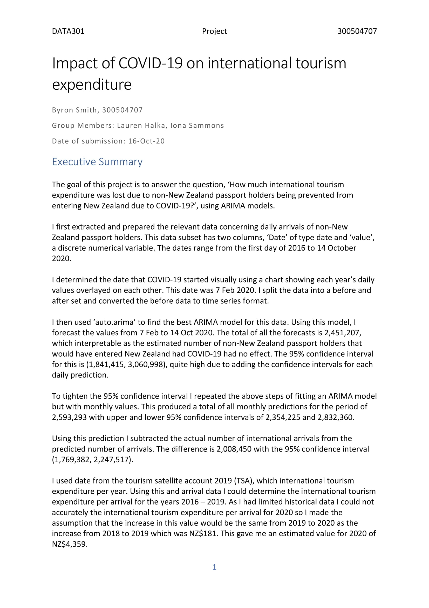
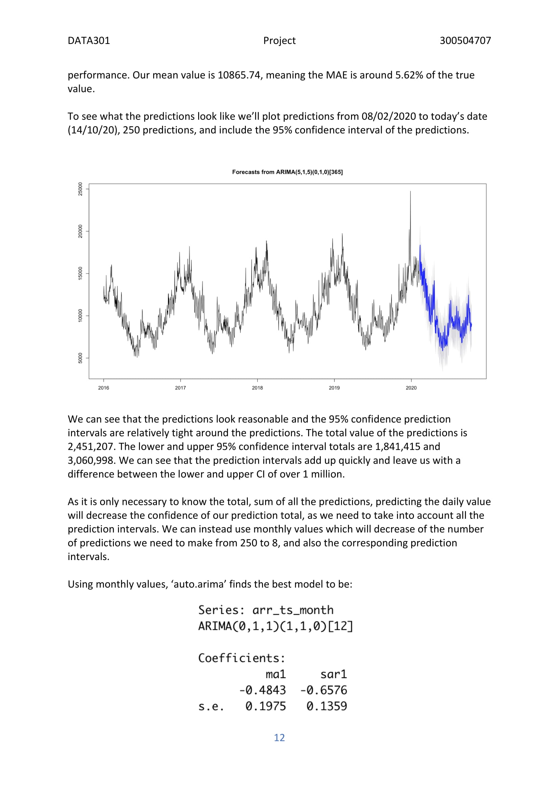

# Travel ARIMA Analysis

This analysis was done as part of a Data Science course, DATA301 at VUW.
The full report can be seen in `project.pdf` or below. 
The analysis code is available in the `code` folder or can be seen in `travel_arima_analysis.pdf`. 

